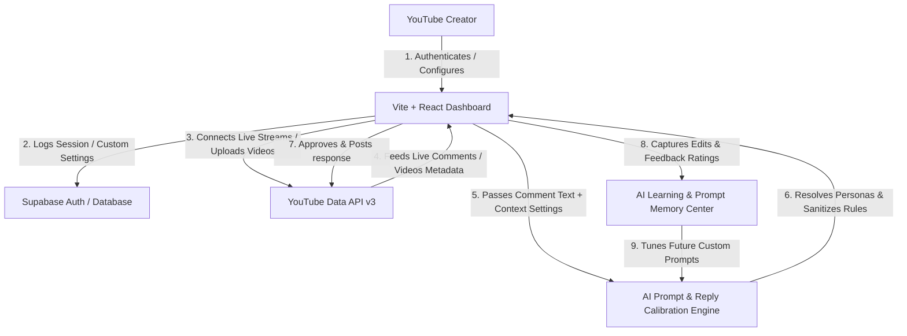
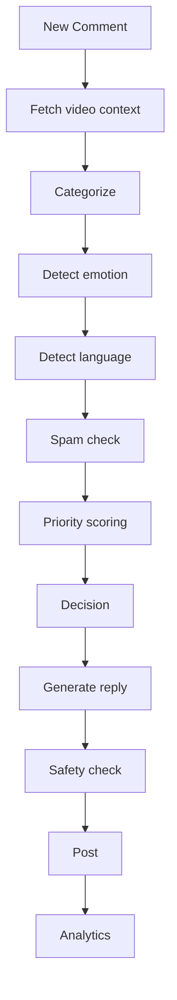

# System Architecture Diagram - Engage AI

The following diagram illustrates the relationship loop and data pipelines of the Engage AI creator dashboard suite:

## System Components

1. **Frontend Layer (Vite + React + TS)**:
   - High-fidelity single-page dashboard tracking comments queues, live streams, and channel analytics.
   - Built on a fluid dark/light design system using CSS variables.
2. **Persistence & Auth Layer (Supabase & LocalStorage)**:
   - Synchronizes session state, handles profile configurations, and persists videos, error logs, and calibration memories.
3. **YouTube Integration Layer**:
   - Integrates YouTube Data and Live API schemas to fetch comments, channel quotas, and handle response postings.
4. **AI Reply Calibration Engine**:
   - Processes context formatting (e.g. Professional, Spiritual, Gaming) and enforces channel guidelines (link stripping, date replacement).
5. **AI Learning & Feedback Center**:
   - Intercepts approved edits, logging rating indicators to refine future prompt injections dynamically.

## AI Workflow Pipeline

The following flowchart demonstrates the step-by-step pipeline a comment travels through when processed by the AI:

